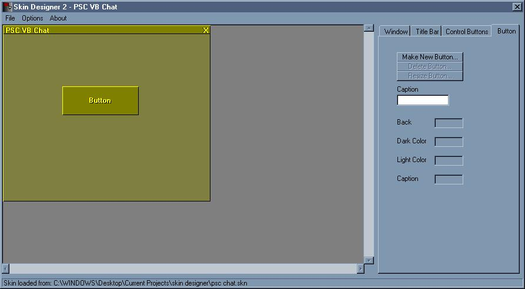



## Skin Editor v2

### Description

a same as before but added features including indivual buttons and file association (which works). please vote and comment!
 
### More Info
 

             |
---                |---
**Submitted On**   |2002-04-14 22:50:00
**By**             |[poop\_4\_brains](https://github.com/Planet-Source-Code/PSCIndex/blob/master/ByAuthor/poop-4-brains.md)
**Level**          |Intermediate
**User Rating**    |4.8 (24 globes from 5 users)
**Compatibility**  |VB 6\.0
**Category**       |[Coding Standards](https://github.com/Planet-Source-Code/PSCIndex/blob/master/ByCategory/coding-standards__1-43.md)
**World**          |[Visual Basic](https://github.com/Planet-Source-Code/PSCIndex/blob/master/ByWorld/visual-basic.md)
**Archive File**   |[Skin\_Edito720324142002\.zip](https://github.com/Planet-Source-Code/poop-4-brains-skin-editor-v2__1-33820/archive/master.zip)

